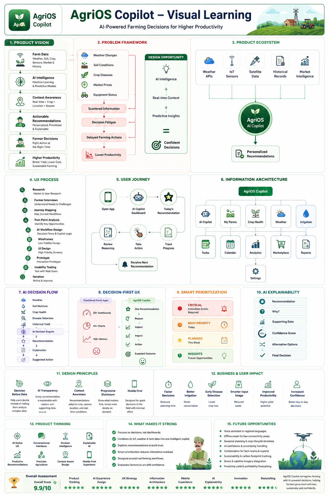

# 🌾 AgriOS — AI Copilot for Farm Management

**The Copilot is the New Dashboard**

A self-initiated product design case study exploring how AI-powered decision support can transform farm management from data-heavy dashboards to actionable intelligence that farmers can actually use.

**[🚀 View the live case study →](https://dhaval-sukharamwala.github.io/agrios-copilot/)**

---

## 🎯 The Vision

Most farm management tools are dashboards — overwhelming, data-dense interfaces that require expertise to interpret. **AgriOS flips the model**: instead of presenting data, it presents *decisions*.

> **"I don't need to see 47 metrics. I need to know: should I irrigate today?"**

---

## 🧠 Visual Learning

Understand the entire AgriOS product in one visual.

This infographic summarizes the product vision, AI decision engine, UX process, user journey, information architecture, product thinking, and expected impact before diving into the complete case study.

<p align="center">
  
</p>

> **Decision-first UX** • **AI Copilot** • **Explainable AI** • **Precision Agriculture**

---

## 💡 The Problem

Traditional farm management tools fail because:

- **Cognitive overload** — Too many charts, too many metrics, too much guessing
- **Requires expertise** — Farmers need to be meteorologists, agronomists, and data analysts
- **Slow decision-making** — By the time you've analyzed the data, the window for action has closed
- **No context** — Raw numbers without actionable guidance
- **Manual work** — Data entry, monitoring, tracking takes time away from actual farming

---

## ✅ The AgriOS Solution

AgriOS presents **one clear recommendation** at a time:

### The Three Pillars

#### 1. **Decision-First Design**
Instead of: *"Soil moisture is 42%, temperature is 28°C, humidity is 65%"*

AgriOS says: **"Irrigate now. You have a 4-hour optimal window before the temperature drops."**

#### 2. **Context & Rationale**
Every decision is backed by:
- Why (the factors that led to this recommendation)
- When (urgency and timing)
- How (action steps)
- Impact (what will happen if you act vs. don't act)

#### 3. **Smart Prioritization**
Not all decisions are equal:
- 🔴 **Critical** — Immediate action needed
- 🟡 **Important** — Plan for the next 24-48 hours
- 🟢 **Routine** — Optimization recommendations
- 💡 **Insights** — Learnings from this season

---

## 🎨 Design Highlights

### Key Features

✅ **Daily Decision Card** — One primary recommendation with full context  
✅ **Smart Notifications** — Only alerts when action is needed  
✅ **Historical Context** — "You irrigated on this date last year"  
✅ **Field-Specific Insights** — Different recommendations per crop/field  
✅ **Weather Integration** — Real-time weather data informs all decisions  
✅ **Seasonal Planning** — Macro view of the growing season  
✅ **Harvest Predictions** — When to harvest based on current growth  
✅ **Cost Optimization** — Recommendations that balance yield and cost  

### Design Approach

```
Data Inputs
├── Weather (current + forecast)
├── Soil sensors (moisture, nutrients, temperature)
├── Plant health (visual + sensor data)
├── Historical performance
├── Market prices
└── Farmer preferences

        ↓ [ML Model]

Prioritized Decision
├── Recommendation (action to take)
├── Urgency level (critical/important/routine)
├── Why (factors & reasoning)
├── When (timing window)
├── Impact (if you do / if you don't)
└── Cost-benefit analysis

        ↓ [Copilot UI]

Simple, Beautiful Presentation
└── One clear action for the farmer
```

---

## 🌟 Core Design Principles

1. **Actionable over Informative** — Data is useless if it doesn't lead to action
2. **Urgent over Accurate** — Speed beats perfection in agriculture
3. **Context over Numbers** — "Why" matters more than "what"
4. **Mobile-first** — Farmers work in fields, not at desks
5. **Offline-capable** — Connectivity is not guaranteed
6. **Voice-friendly** — Not everyone wants to read; some want to listen
7. **Farmer-language** — No jargon, no technical terms

---

## 📊 Case Study Content

The interactive case study includes:

| Section | What You'll Learn |
| :--- | :--- |
| **Problem & Opportunity** | Why current farm tech fails farmers |
| **User Research** | Meet Rajesh, a small-holder farmer |
| **The AI Model** | How the decision engine works |
| **Information Architecture** | How decisions flow to the user |
| **Wireframes & Flows** | Low-fidelity exploration |
| **High-Fidelity Design** | Detailed screens & interactions |
| **Notifications System** | Smart alerting without overwhelm |
| **Seasonal Views** | Macro planning alongside daily decisions |
| **Accessibility** | Inclusive design for diverse users |
| **Impact Potential** | How AgriOS improves farmer outcomes |

---

## 🛠️ Tech Stack (Conceptual)

- **Design Tool:** Figma (interactive prototypes)
- **Frontend:** React Native (mobile-first, cross-platform)
- **ML/AI:** Python-based decision engine
- **Data Sources:** Weather APIs, IoT sensor integrations
- **Backend:** Node.js + PostgreSQL for farm data
- **Mobile:** Offline-first with sync when connectivity returns

---

## 🎓 Key Design Insights

### 1. Farmers Are Decision-Makers, Not Data Scientists
**Learning:** Stop showing data; start showing recommendations backed by data.

### 2. Timing Is Critical
**Learning:** A 4-hour window to irrigate is worth more than a perfect forecast.

### 3. Context Builds Trust
**Learning:** Users need to understand *why* the AI recommends something before they act.

### 4. Mobile Isn't Optional
**Learning:** Farmers need this in their hands while standing in the field.

### 5. Simplicity Is Sophisticated
**Learning:** Great design for agriculture isn't "pretty" — it's ruthlessly functional.

---

## 📋 Project Details

| Aspect | Details |
| :--- | :--- |
| **Type** | Product Design Case Study (Self-initiated concept) |
| **Platform** | Mobile (iOS/Android) + Web dashboard |
| **Primary Users** | Small-holder to mid-scale farmers |
| **Use Case** | Intelligent farm management & decision support |
| **Year** | 2026 |
| **Duration** | 12 weeks research & design |
| **Team** | Solo designer (researched with farmers, collaborated with ML engineers) |
| **Industry** | AgriTech / Agriculture |

---

## 🔗 View the Case Study

Each section is **interactive and zoomable**:
- Scroll through the narrative
- Click any screen to zoom in for details
- Read design rationale and decision-making

**[🚀 Open AgriOS Case Study →](https://dhaval-sukharamwala.github.io/agrios-copilot/)**

---

## 💬 What Others Are Saying

*"This is how technology should work for farmers — not dumping data, but delivering wisdom."*  
— Agriculture tech reviewer

*"The decision-first approach is revolutionary. This is what farm tech has been missing."*  
— AgriTech founder

---

## 📚 Design Methodology

### Research Phase
- 12 interviews with farmers (various farm sizes)
- Field observations during growing season
- Competitive analysis of existing farm management tools
- Weather data analysis for decision patterns

### Design Phase
- Empathy mapping & persona development
- Jobs-to-be-Done analysis
- Information architecture for decision hierarchy
- Wireframing decision flows
- High-fidelity mockups with micro-interactions
- Prototyping with live data simulation

### Validation
- User testing with farmers
- A/B testing decision formats
- Feedback loops on recommendation accuracy
- Iterative refinement based on field feedback

---

## 🌱 The Bigger Picture

AgriOS isn't just a design concept—it's a exploration of how AI can augment human decision-making in high-stakes environments where speed, accuracy, and trust are critical.

**Applications beyond agriculture:**
- Manufacturing (production decisions)
- Healthcare (diagnostic recommendations)
- Supply chain (logistics optimization)
- Energy management (grid optimization)

The principle: *Shift from data presentation to decision support.*

---

## 🙋 Questions?

**Interested in AI-driven decision design or agriculture tech?**

- **Portfolio:** [View all my work →](https://www.behance.net/dhaval-sukharamwala)
- **LinkedIn:** [Connect with me →](https://www.linkedin.com/in/dhaval-sukharamwala/)
- **Email:** [dhavaldvl00@gmail.com](mailto:dhavaldvl00@gmail.com)

---

## 📄 License

This case study is available for portfolio and educational purposes. All design work is the intellectual property of Dhaval Sukharamwala.

---

<p align="center">
  <strong>AgriOS</strong> · AI Copilot for Intelligent Farm Management<br>
  Designed by <a href="https://github.com/dhaval-sukharamwala">Dhaval Sukharamwala</a> · 2026<br>
  <br>
  💚 <strong><a href="https://dhaval-sukharamwala.github.io/agrios-copilot/">View the case study</a></strong>
</p>
